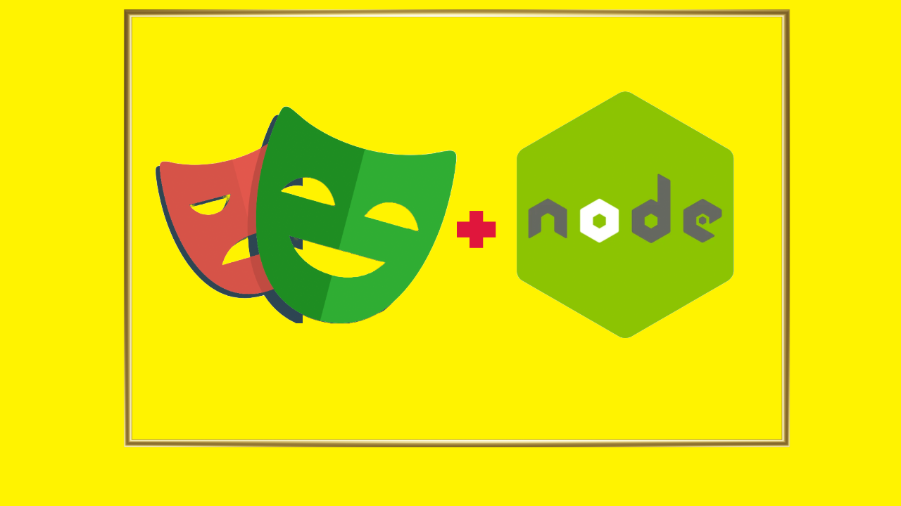

# Let's learn Playwright together! 🚀




>
>
> ## Table of Contents
>
> - [What is Playwright?](#what-is-playwright)
> - [Why Playwright?](#why-playwright)
> - [Course Breakdown - Structure of this course](#course-breakdown---structure-of-this-course)
> - [How to Install Playwright?](#how-to-install-playwright)
> - [How to install Node.js?](#how-to-install-nodejs)
> - [How to install npm?](#how-to-install-npm)
> - [How to install yarn?](#how-to-install-yarn)
> - [Connect and Collaborate](#connect-and-collaborate)
>

***

## What is Playwright?

***

Playwright is a Node.js library to automate the Chromium, WebKit, and Firefox browsers with a single API. It enables
cross-browser web automation that is ever-green, capable, reliable, and fast.

## Why Playwright?

***

- **Evergreen**: Playwright is always up-to-date, automating the latest browser versions.
- **Single API**: Playwright unifies the APIs of Chromium, WebKit, and Firefox.
- **Capabilities**: Playwright supports browser contexts, giving you full control over cookies, permissions, and
  storage.
- **Reliability**: Playwright is built to be reliable, capable of running thousands of tests in CI.
- **Speed**: Playwright is fast, enabling fast execution of tests and automation scripts.
- **Open Source**: Playwright is open-source and free to use.
- **Community**: Playwright has a growing community of contributors and users.
- **Cross-Browser**: Playwright supports Chromium, WebKit, and Firefox.
- **Cross-Platform**: Playwright supports Windows, macOS, and Linux.
- **Headless Mode**: Playwright supports headless mode for all browsers.
- **Mobile Browsers**: Playwright supports mobile browsers like WebKit on iOS and Chrome on Android.
- **Web Components**: Playwright supports shadow DOM and custom elements.
- **Modern Web**: Playwright supports modern web features like service workers, web components, and more.
- **Debugging**: Playwright supports debugging with DevTools.
- **CI/CD**: Playwright supports running tests in CI/CD environments.
- **Integration**: Playwright integrates with popular testing frameworks like Jest, Mocha, and Jasmine.
- **DevTools Protocol**: Playwright uses the Chrome DevTools Protocol for automation.
- **Extensions**: Playwright supports browser extensions.
- **Screenshots**: Playwright supports taking screenshots.
- **Videos**: Playwright supports recording videos.
- **Network**: Playwright supports intercepting network requests.
- **Performance**: Playwright supports measuring performance metrics.
- **Accessibility**: Playwright supports testing for accessibility.
- **Automation**: Playwright supports automating web applications.
- **Code Generation**: Playwright supports generating code for automation. Record and replay.🚀

## Course Breakdown - Structure of this course

***
This course covers Playwright for UI and API automation. We have also prepared a side-by-side real framework project.

> Install any Markdown formatter in ide for better Markdown file previews.
> **Open these Markdown files in preview mode if your IDE by default opens them in edit mode.**

Navigate to the following directories to access the content:

- [UI Automation](./pw-with-ts)
- [API Automation](./pw-api-tests)
- [UI Automation Framework Project](./pw-ui-framework)
- [Theoretical Notes - Markdown files](./theory-notes)
  - [Playwright and NPM Commands](theory-notes/playwright-cli/commands.md)
  - [VS Code Setup](theory-notes/ide-setup/vs-code-setup.md)
  - [Configuration](theory-notes/playwright-config/config-options.md)
  - [Browsers](./theory-notes/browsers/browsers.md)
  - [CI/CD](./theory-notes/ci-cd/ci-cd.md)
  - [Page Object Model](./theory-notes/page-object-model/pom.md)

## How to Install Playwright?

***
You can install Playwright using npm or yarn. Here's how you can install Playwright using npm:

```bash
npm init playwright@latest
```

Here's how you can install Playwright using yarn:

```bash
yarn create playwright
```

## How to install Node.js?

You can install Node.js from the official website: <https://nodejs.org/>

## How to install npm?

npm is included with Node.js. You can install Node.js from the official website: <https://nodejs.org/>

## How to install yarn?

You can install yarn using npm. Here's how you can install yarn using npm:

```bash
npm install -g yarn
```

## Connect and Collaborate

- Read Playwright official documentation [here](https://playwright.dev/docs/intro).
- Access Playwright Community Pages [here](https://playwright.dev/community/welcome).
- Join the Discord Server for this course: [Code with Akash](https://discord.gg/6TTXCheZ8u)

***
